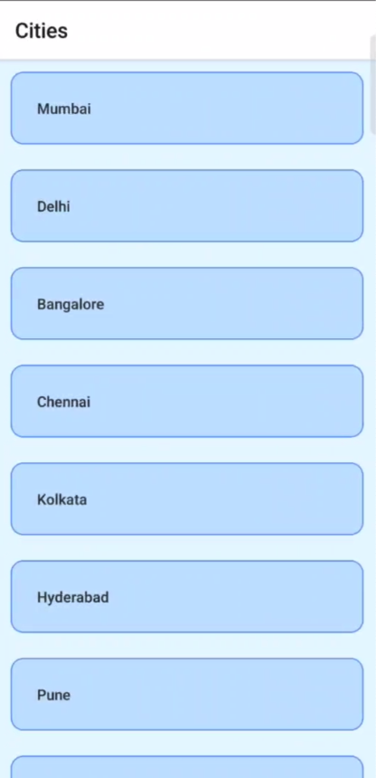
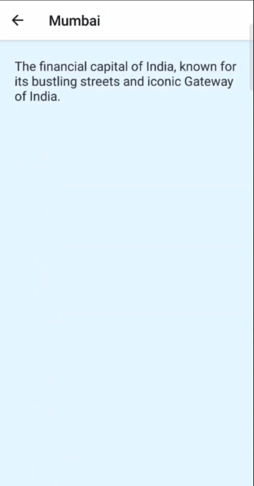

# CityInsightApp

CityInsight App is a simple ReactNative App that lists various cities.

## Features

- View City list.
- View Invidual City details.

## Screenshots

<!-- Add screenshots of your app here -->

### Home Screen



### City Detail



## Installation

To run this app on your local machine, follow these steps:

1. Clone this repository:

   ```bash
   git clone https://github.com/Bavarna/CityInsight.git
   ```

2. cd CityInsight
3. Install dependencies: yarn
4. Run the app: yarn start
